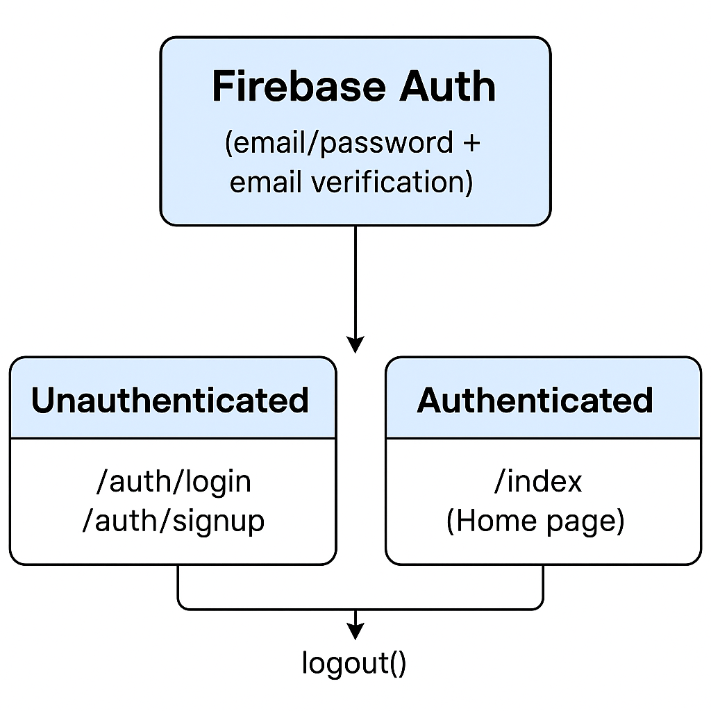

# 📝 React Native To-Do App

A mobile To-Do application built using **React Native (Expo)** with Firebase Authentication, allowing users to manage tasks with time settings, authentication flow, and theme switching.

---

## Features

- **Firebase Authentication**
  - Login, Signup, Logout
  - Redirect flow from login → signup → home (index) after authentication

- **Task Management**
  - Add, delete, and mark tasks as complete
  - Set custom time for reminders

- **Theme Switching**
  - Light and Dark mode using Context API

---

## Folder Structure

todo-app/
├── app/
│ ├── _layout.tsx # App layout with theme provider
│ ├── LoginScreen.tsx # Login screen
│ ├── SignupScreen.tsx # Signup screen
│ └── tabs/
│ └── index.tsx # Main page (task list)
├── components/ # Reusable UI components
│ └── ThemeContext.tsx # Context for theme toggling
├── scripts/
│ └── firebase.js # Firebase config
├── assets/
├── fonts/
├── images/
├── app.json
├── package.json
└── README.md

